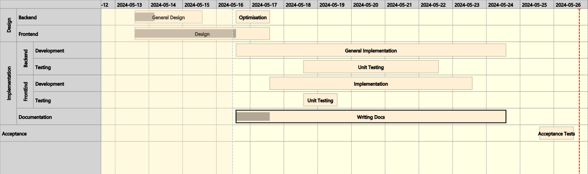

# Timeline Chart

    <dependency>
        <groupId>eu.dariolucia.jfx</groupId>
        <artifactId>eu.dariolucia.jfx.timeline</artifactId>
        <version>${timeline.version}</version>
    </dependency>

## Introduction
This module contains an implementation of a timeline/Gantt chart for JavaFX. The widget supports the following features:
- Definition of several task item per task line, each with its own colour, start time, expected and actual durations; 
- Grouping of task lines in flat groups and hierarchical groups;
- Projection of aggregated task item durations when groups are collapsed or always on; 
- Handling of time overlaps among task items belowing to the same task line, dynamically rendered on separate lines;
- Time cursors and time intervals (in foreground and background);
- Time points with basic shapes and custom images (contributions from  [Shersula](https://github.com/Shersula))
- Scrolling and zooming via mouse scroll;
- Single selection model for task items;
- Dynamic column sizing;
- Appearance fully customisable per task item, task lines and group of lines via inheritance;
- Usable programmatically and via FXML.

## Usage (basic)

    // Create timeline
    Timeline tl = new Timeline();
    // Add data defaults for testing
    Instant currentTime = Instant.now();
    tl.setMinTime(currentTime.minusSeconds(3600));
    tl.setMaxTime(currentTime.plusSeconds(12800));
    tl.setViewPortStart(currentTime);
    tl.setViewPortDuration(1200);
    // Add task lines
    TaskLine theLine = new TaskLine("Task Line 1", "First task line");
    // Add items to the task line
    theLine.getItems().add(new TaskItem("Task 1", currentTime.plusSeconds(30), 98, 0));
    theLine.getItems().add(new TaskItem("Task 2", currentTime.plusSeconds(130), 28, 0));
    // Add the task line to the timeline
    tl.getItems().add(theLine);
    // Add to application and render

## Limitations
For optimisation reasons, the widget works with a time resolution in seconds. Sub-second resolution is not supported, i.e.
times are truncated to seconds.
